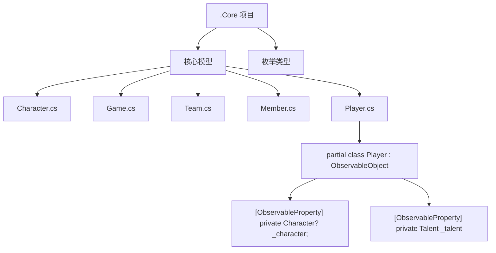
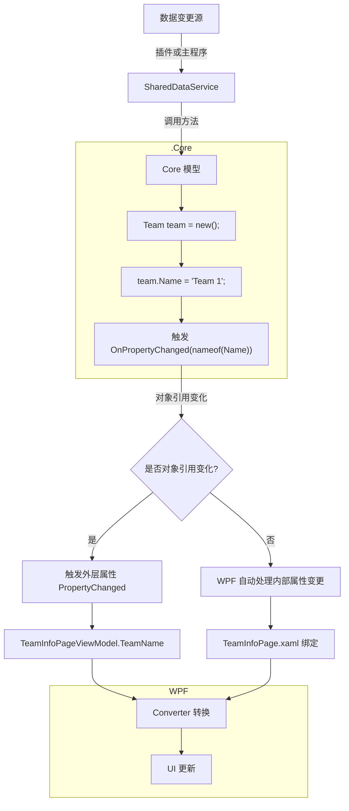
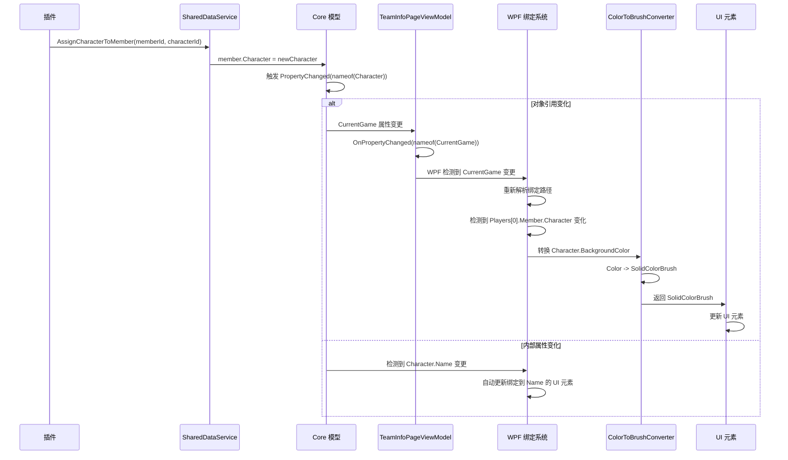

# 核心数据流架构

> 本文档描述 Core 模型、共享数据服务和 WPF 绑定系统之间的数据流。共享状态字段、CurrentGame、队伍、Ban 和前台绑定的字段语义见 [shared-data-and-state.md](shared-data-and-state.md)。

## 整体架构概览

```
┌─────────────────────────────────────────────────────────────────────────────────────────────┐
│                                     neo_bpsys_wpf.Core                                │
│                                                                                           │
│  ┌─────────────┐     ┌──────────┐     ┌─────────────┐     ┌──────────────┐     ┌───────┐  │
│  │   Models    │────▶│  Enums   │────▶│ ValueTypes  │────▶│  Interfaces  │────▶│ Events│  │
│  └─────────────┘     └──────────┘     └─────────────┘     └──────────────┘     └───────┘  │
│         │                                                                 ▲               │
│         │                                                                 │               │
│         ▼                                                                 │               │
│  ┌─────────────────────┐                                                  │               │
│  │  Core Business Logic│◀─────────────────────────────────────────────────┘               │
│  └─────────────────────┘                                                                  │
└─────────────────────────────────────────────────────────────────────────────────────────────┘
                         ▲                                  │
                         │                                  │
                         │                                  ▼
┌─────────────────────────────────────────────────────────────────────────────────────────────┐
│                                  neo_bpsys_wpf (主项目)                                      │
│                                                                                           │
│  ┌─────────────┐     ┌──────────────┐     ┌─────────────┐     ┌───────────────────┐       │
│  │  ViewModels │────▶│     Views    │────▶│ Converters  │────▶│   UI Controls     │       │
│  └─────────────┘     └──────────────┘     └─────────────┘     └───────────────────┘       │
│         ▲                                                                             │
│         │                                                                             │
│         └─────────────────────────────────────────────────────────────────────────────┘
└─────────────────────────────────────────────────────────────────────────────────────────────────────────────────────────────┘
                         ▲
                         │
                         │
┌─────────────────────────────────────────────────────────────────────────────────────────────┐
│                                  插件系统 (Plugin)                                          │
│                                                                                           │
│  ┌─────────────┐     ┌───────────────────┐                                                │
│  │   Plugins   │────▶│ ISharedDataService│─────────────────────────────────────────────────▶│
│  └─────────────┘     └───────────────────┘                                                │
└─────────────────────────────────────────────────────────────────────────────────────────────┘
```

## 详细数据流流程

### 1. 数据结构定义（.Core 项目）



### 2. 数据变更流程



### 3. 完整数据变更到 UI 更新流程



## Example

### 1. .Core 项目结构

```
neo_bpsys_wpf.Core/
├─ Models/
│   ├─ Character.cs
│   ├─ Talent.cs
│   ├─ Game.cs 
│   ├─ Player.cs
│   ├─ Score.cs
│   ├─ Team.cs
│   └─ ...  
├─ Enums/
│   ├─ BanListName.cs
│   ├─ Camp.cs
│   ├─ GameAction.cs
│   └─ ...  
└─ Abstractions/
	└─ Services/
		├─ IFrontService.cs
    	└─ ISharedDataService.cs
```

### 2. 数据流关键点说明

#### a) 对象引用变化处理（如更换 Character）

```csharp
// SharedDataService.cs
public void AssignCharacterToMember(Guid memberId, Guid characterId) // 此方法实际并不存在，程序中直接用的赋值
{
    var member = GetMemberById(memberId);
    var oldCharacter = member.Character;
    var newCharacter = GetCharacterById(characterId);
    
    if (oldCharacter != newCharacter)
    {
        member.Character = newCharacter;
        // 触发 Member.Character 的 PropertyChanged
        // WPF 会自动更新绑定到 Member.Character 的所有 UI
    }
}
```

```csharp
// TeamInfoPageViewModel.cs
// 不需要特殊处理 - WPF 会自动更新 {Binding Players[0].Member.Character.Name}
```

#### b) 对象替换处理（如更换 CurrentGame）

```csharp
// SharedDataService.cs
private Game _currentGame;
public event EventHandler CurrentGameChanged;

public Game CurrentGame
{
    get => _currentGame;
    set
    {
        if (_currentGame != value)
        {
            _currentGame = value;
            CurrentGameChanged?.Invoke(this, EventArgs.Empty);
        }
    }
}

public void StartNewGame()
{
    CurrentGame = new Game(); // 会触发 CurrentGameChanged
}
```

```csharp
// TeamInfoPageViewModel.cs
public TeamInfoPageViewModel(ISharedDataService sharedData)
{
    _sharedData = sharedData;
    _sharedData.CurrentGameChanged += (s, e) => 
        OnPropertyChanged(nameof(CurrentGame));
}

public Game CurrentGame => _sharedData.CurrentGame;
```

```xaml
<!-- TeamInfoPage.xaml -->
<TextBlock Text="{Binding CurrentGame.Players[0].Member.Character.Name}"/>
<!-- 当 CurrentGame 对象被替换时，会重新解析整个绑定路径 -->
```
