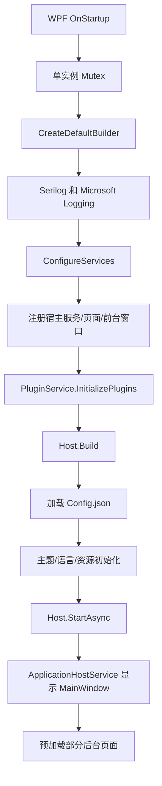

# 运行时架构

## 技术栈

主应用是 .NET 9 WPF 应用，目标框架为 `net9.0-windows10.0.20348`。当前代码使用 WPF-UI、Generic Host、Microsoft DI、Serilog、WPFLocalizeExtension、OpenCvSharp、PaddleOCR、YamlDotNet 和自定义插件 SDK。

## 启动流程

入口在 `neo-bpsys-wpf/App.xaml.cs`：

1. 设置控制台日志编码为 UTF-8。
2. 设置应用生命周期为 `Initializing`。
3. 以 `AppConstants.AppName` 创建单实例 `Mutex`；如果已有实例，弹窗提示并关闭。
4. 创建 `IAppHost.Host`：
   - `Host.CreateDefaultBuilder()`
   - `UseSerilog(...)`
   - `ConfigureLogging(...)`
   - `ConfigureServices(ConfigureServices)`
   - `Build()`
5. 调用 `base.OnStartup(e)`。
6. 设置 WPF 动画目标帧率为 100。
7. 从 DI 获取 logger，记录启动日志。
8. 加载配置：`ISettingsHostService.LoadConfig()`。
9. 根据配置应用日志级别。
10. 初始化部分资源图标、主题、语言。
11. `IAppHost.Host.StartAsync()`，触发 hosted service。
12. 设置生命周期为 `Running`。
13. 启动更新检查受条件编译控制；当前源码条件写作 `#if !DEBUG && !Preview`。项目配置定义的是 `PREVIEW`，因此不要在未编译验证前断言 Preview 构建一定被排除。

退出时 `OnExit` 会发送 `AppStopping`，记录关闭日志，停止并释放 Host。

当前启动链可以简化为：



`App` 继承 `AppBase`。`AppBase` 提供 `Restart()`、`ShutDown()`、`AppStarted`、`AppStopping` 和 `CurrentLifetime` 抽象。`IAppHost.Host` 是 Core 层暴露的静态 Host 引用，插件和部分后台代码通过它访问 DI 容器。

## WPF + Generic Host

`App.Services.xaml.cs` 是服务注册中心。这里将 WPF 页面、窗口和业务服务都放入 Microsoft DI 容器。主窗口通过 `INavigationWindow` 注册为单例，构造时注入导航、InfoBar、Snackbar、设置服务和 logger。

当前大多数 View、ViewModel、Service 是 singleton。维护时不要随意改生命周期，因为 WPF 绑定、导航页面缓存、前台窗口状态和共享数据都依赖这种长期实例模型。

## Serilog

日志目录来自 `AppConstants.LogPath`：

```text
%APPDATA%\neo-bpsys-wpf\Log
```

Serilog 同时写 Console 和文件。文件名为 `log-.txt` 的滚动格式，按小时滚动，`retainedFileCountLimit` 当前为 3。初始日志级别会在 Host 构建前尝试从 `Config.json` 的 `LogLevel` 字段读取，配置加载后再通过 `App.ApplyLogLevel(...)` 动态应用。

注意：代码注释写“只保留最近3天”，但 Serilog 参数实际是 `retainedFileCountLimit: 3`，更准确地说是保留 3 个滚动文件。文档按代码行为描述。

## 设置、主题与语言

设置文件路径是：

```text
%APPDATA%\neo-bpsys-wpf\Config.json
```

`SettingsHostService` 负责读写。保存时会把当前用户 AppData 路径替换成 `%APPDATA%`，降低配置跨机器或用户名变化时的路径耦合。

主题启动时固定应用深色：`ApplicationThemeManager.Apply(ApplicationTheme.Dark)`。主题切换会更新 `IconThemesDictionary`。

语言由 `Settings.Language` 推导 `CultureInfo`。启动时设置：

```csharp
LocalizeDictionary.Instance.Culture = settingService.Settings.CultureInfo;
Application.Current.Resources["CurrentLanguage"] =
    XmlLanguage.GetLanguage(settingService.Settings.CultureInfo.Name);
```

因此新增用户可见文本时应优先进入 `Locales/Lang.resx` 及对应语言资源。

## ApplicationHostService

`ApplicationHostService` 是 `IHostedService`。Host 启动后它会：

1. 解析 `INavigationWindow`，显示 `MainWindow`。
2. 预加载 `PickPage`、`BanSurPage`、`BanHunPage`，代码注释说明是为了提前加载使用 `CharaSelector` 的页面，减少使用时卡顿。
3. 导航回 `HomePage`。

这是 UI 启动链的一部分，不是后台服务进程。

## 插件初始化为何在 Host Build 前

`ConfigureServices` 的最后调用：

```csharp
PluginService.InitializePlugins(context, services);
```

插件的 `Initialize(context, services)` 能注册后台页面、前台窗口、注入控件、自定义服务等。这些注册必须发生在 `Host.Build()` 前，否则 DI 容器已经冻结，插件无法参与 WPF-UI 页面提供器、窗口构造和服务解析。

因此插件安装/更新后通常需要重启应用。插件包被复制到插件目录不等于它已经进入当前进程的 DI 容器。
